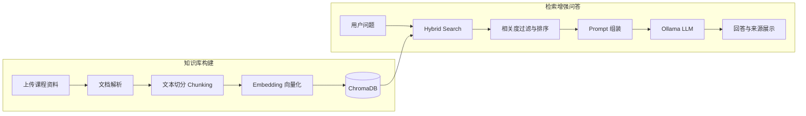

# AI Study Assistant 📚

基于 RAG（Retrieval-Augmented Generation，检索增强生成）与本地大语言模型的课程智能学习助手。

项目面向学生学习场景，可将个人课程资料构建为本地知识库，并围绕资料内容进行智能问答、内容总结和考试复习。系统通过文档解析、文本切分、向量化存储、混合检索和提示词构造，让模型在相关课程资料的基础上生成回答，并展示参考来源。

## 📸 项目展示

<!-- 请将 xxx.png 替换为 image 文件夹中图片的实际文件名，例如 demo.png -->

![AI Study Assistant 项目界面]


## ✨ 功能特性

### 📄 学习资料管理

- 支持上传 PDF、DOCX、XLSX、TXT 等格式的课程资料
- 自动提取文档中的文本内容
- 对长文档进行文本切分（Chunking）
- 保存文档摘要及文本片段的来源信息

### 🔍 RAG 知识库问答

- 使用 Embedding 模型将文本片段转换为向量
- 使用 ChromaDB 构建本地向量知识库
- 通过 Hybrid Search 结合语义检索与关键词检索
- 使用相关度阈值过滤低相关文本片段，减少无关上下文干扰
- 根据检索到的课程资料构造上下文并生成回答

### 🤖 大语言模型交互

- 支持本地 Ollama 大语言模型
- 支持回答内容流式输出
- 支持多轮对话上下文记忆
- 当资料不足时约束模型避免编造答案

### 📚 学习辅助模式

- **智能问答**：围绕已上传课程资料回答具体问题
- **内容总结**：提炼章节内容和核心知识点
- **考试复习**：整理重点、易错点与复习提纲

### 🔗 回答来源追踪

- 展示参考资料文件名
- 展示文本片段编号与相关度
- 展示相关内容预览，便于核对回答依据

## ⭐ 项目亮点

- 基于完整 RAG 流程实现个人课程知识库问答，而非仅调用通用聊天接口
- 使用 Embedding 与 ChromaDB 完成本地向量化存储和语义检索
- 设计 Hybrid Search，将语义相似度与关键词匹配结合，提高相关内容的召回能力
- 引入相关度阈值过滤机制，减少低相关文本进入模型上下文
- 针对不同学习目标设计智能问答、内容总结和考试复习三种提示词模式
- 保存并展示检索片段的来源、编号、相关度和内容预览，提高回答的可追溯性
- 通过 Ollama 在本地运行模型，降低课程资料上传到外部服务所带来的隐私风险

## 🏗️ 系统架构

系统由“知识库构建”和“检索增强问答”两条流程组成：



### 工作流程

1. 用户上传课程资料，系统提取其中的文本内容。
2. 长文本被切分为多个 Chunk，并记录文件名、片段编号和内容预览等元数据。
3. Embedding 模型将文本片段转换为向量，并写入 ChromaDB。
4. 用户提出问题后，系统通过 Hybrid Search 检索相关片段。
5. 系统对检索结果进行排序和相关度过滤，将有效内容组装进 Prompt。
6. Ollama 本地大语言模型根据问题和检索上下文生成回答。
7. 页面展示回答及对应的参考资料，方便用户核对来源。

## 🛠️ 技术栈

| 模块 | 技术 |
| --- | --- |
| 编程语言 | Python |
| Web 界面 | Streamlit |
| RAG / LLM | RAG、Embedding、Prompt Engineering、Ollama |
| 向量数据库 | ChromaDB |
| 检索方式 | Hybrid Search（语义检索 + 关键词检索） |
| 文档处理 | PyPDF2、python-docx、openpyxl |

## 🚀 运行方式

### 1. 克隆项目

```bash
git clone <https://github.com/zhhan56-png/AI-Study-Assistant>
cd <AI-Study-Assistant>
```

### 2. 创建并激活环境

推荐使用 Python 3.11：

```bash
conda create -n ai-study python=3.11
conda activate ai-study
```

也可以直接使用已有的 Python 虚拟环境。

### 3. 安装依赖

```bash
pip install -r requirements.txt
```

### 4. 安装并准备 Ollama 模型

先安装 [Ollama](https://ollama.com/)，然后启动服务：

```bash
ollama serve
```

首次运行前，需要下载项目配置中使用的聊天模型和 Embedding 模型：

```bash
ollama pull <llama3.1>
ollama pull <Paraphrase-multilingual>
```


### 5. 启动项目

```bash
streamlit run app.py
```

启动成功后，根据终端提示在浏览器中打开 Streamlit 页面。

## 📖 使用方法

1. 启动 Ollama 服务和 Streamlit 应用。
2. 在页面中上传 PDF、DOCX、XLSX 或 TXT 课程资料。
3. 等待系统完成文本解析、切分、向量化和知识库构建。
4. 选择智能问答、内容总结或考试复习模式。
5. 输入问题并查看回答、参考文件、文本片段和相关度信息。

## ✅ 已完成功能

- [x] PDF、DOCX、XLSX、TXT 文档解析
- [x] 文本切分与文档摘要保存
- [x] Embedding 向量生成与 ChromaDB 存储
- [x] 语义检索与关键词检索结合的 Hybrid Search
- [x] 低相关文本片段过滤
- [x] 智能问答、内容总结、考试复习三种学习模式
- [x] 流式回答与多轮对话
- [x] 参考文件、片段编号、相关度和内容预览展示
- [x] Ollama 本地模型接入

## ⚠️ 当前能力边界

当前版本主要面向以文本内容为主的课程资料。对于扫描版 PDF，或包含大量图片、公式、卡诺图、电路图和复杂表格的教材，文本提取结果可能不完整。

当检索上下文只包含“如图所示”或“见表格”等描述、但没有图表的具体内容时，系统无法可靠还原相应信息。此类资料需要后续结合 OCR、公式识别或多模态模型进一步处理。

## 报错显示
400报错为模型选择错误，请更改
500报错为连接错误，请修改代码

